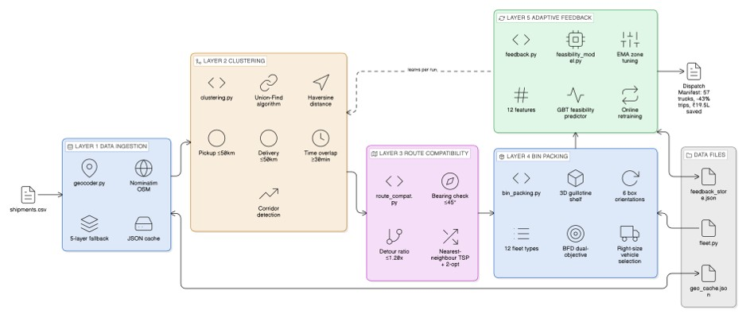
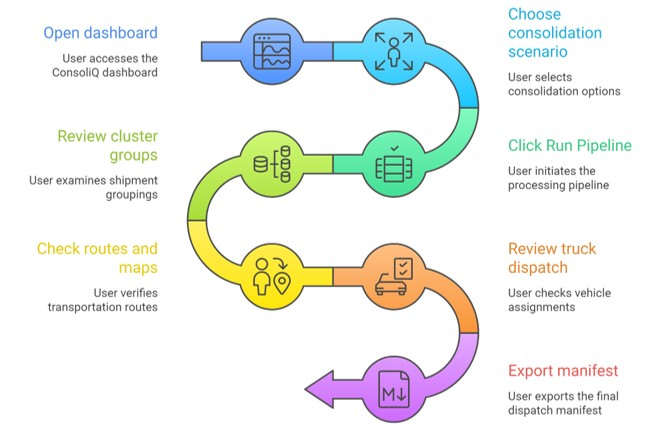

<div align="center">

# 🚛 ConsoliQ

### AI Load Consolidation Optimization Engine
**Built for LoRRI — LogisticsNow Hackathon Round 2 · Problem Statement 5**

[](https://consoliq.streamlit.app)
[](https://python.org)
[](https://streamlit.io)
[](https://scikit-learn.org)

---

> **ConsoliQ** solves India's empty-truck problem. Every day, trucks across the country leave depots at 40–50% capacity — wasting fuel, emitting excess CO₂, and inflating freight costs. ConsoliQ's multi-layer AI engine figures out which shipments can share a truck, assigns the right vehicle size, plans the optimal route, and learns from every run.

---

### 📊 Results on 100-Shipment Benchmark

| Metric | Value |
|--------|-------|
| 🚛 Trip Reduction | **100 → 57 trucks (-43%)** |
| 💰 Cost Savings | **₹19.57 lakhs (+40.6% vs solo)** |
| 🌿 CO₂ Avoided | **18,561 kg (-29%)** |
| 📦 Consolidation Rate | **58% of shipments grouped** |
| ⚡ Avg Load Factor | **55% overall / 63–68% multi-shipment** |

</div>

---

## 📋 Table of Contents

- [Problem Statement](#-problem-statement)
- [Solution Overview](#-solution-overview)
- [Architecture](#-architecture)
- [Pipeline Layers](#-pipeline-layers)
- [AI & ML Components](#-ai--ml-components)
- [Project Structure](#-project-structure)
- [Installation](#-installation)
- [Usage](#-usage)
- [Configuration](#-configuration)
- [Fleet Configuration](#-fleet-configuration)
- [Dashboard Features](#-dashboard-features)
- [Scenario Simulator](#-scenario-simulator)
- [Key Formulas](#-key-formulas)
- [India-Specific Design](#-india-specific-design)
- [Scalability](#-scalability)
- [Roadmap](#-roadmap)
- [Tech Stack](#-tech-stack)

---

## 🎯 Problem Statement

LoRRI is India's freight intelligence platform connecting shippers and transporters across 1,000+ routes. The core inefficiency: **most trucks dispatch with 40–60% empty space** because individual shipments are booked independently with no visibility into compatible co-loads.

**ConsoliQ's mission:** Automatically identify shipments that can share a truck — same direction, compatible timing, physically packable together — and build an optimal dispatch manifest.

---

## 💡 Solution Overview

ConsoliQ is a **5-layer AI pipeline** that transforms a raw CSV of shipments into a complete, optimised dispatch plan:

```
Raw Shipments (CSV)
      │
      ▼
┌─────────────────────┐
│  Layer 1            │  Geocoding + validation
│  Data Ingestion     │  5-layer error handling
└─────────┬───────────┘
          │
          ▼
┌─────────────────────┐
│  Layer 2            │  Union-Find + time windows
│  Clustering         │  Haversine distance, corridor detection
└─────────┬───────────┘
          │
          ▼
┌─────────────────────┐
│  Layer 3            │  Bearing + detour checks
│  Route Compat.      │  Nearest-neighbour + 2-opt TSP
└─────────┬───────────┘
          │
          ▼
┌─────────────────────┐
│  Layer 4            │  3D guillotine shelf packing
│  Bin Packing        │  BFD dual-objective, right-size vehicle
└─────────┬───────────┘
          │
          ▼
┌─────────────────────┐
│  Layer 5            │  EMA zone tuning + GBT predictor
│  Feedback Loop      │  Online retraining each run
└─────────┬───────────┘
          │
          ▼
 Dispatch Manifest
 (57 trucks, routes, LF scores, CO₂)
```

---

##  System Architecture


## User Flow



---

## 🔧 Pipeline Layers

### Layer 1 — Data Ingestion (`geocoder.py`)

Reads shipment CSV and resolves hub names to coordinates via the Nominatim OSM API.

**5-layer geocoder fallback:**
1. Exact city match at zoom=10
2. Bounding-box centroid fallback
3. City/district level at zoom=8
4. State/country centroid
5. Graceful skip with warning log

**Performance:** Persistent JSON cache at `data/geo_cache.json` — each hub geocoded exactly once. Saves ~2 minutes per run on repeat executions.

---

### Layer 2 — Clustering (`clustering.py`)

Groups shipments that can share a truck using **Union-Find** with three hard rules:

| Rule | Check | Threshold |
|------|-------|-----------|
| Origin proximity | Haversine between pickup hubs | ≤ 50 km |
| Destination proximity | Haversine between delivery points | ≤ 50 km |
| Time window overlap | Shared delivery window | ≥ 30 minutes |

**Additional features:**
- Live centroid recomputation after every union-find merge
- Corridor detection — absorbs wide-bearing groups into shared highway routes
- Second-pass singleton re-grouping — singletons get a second chance against corridor routes
- HITL hooks for borderline decisions

**Complexity:** O(n·α(n)) ≈ near-linear — scales to millions of shipments.

---

### Layer 3 — Route Compatibility (`route_compat.py`)

Validates every group against three route safety checks before dispatch:

**1. Bearing Check**
```
bearing = atan2( sin(Δlng) × cos(lat2),
                 cos(lat1) × sin(lat2) - sin(lat1) × cos(lat2) × cos(Δlng) )

Max bearing spread: 45°
```

**2. Detour Ratio Check**
```
detour_ratio = route_km_multi_drop / direct_km

Threshold: ≤ 1.20 (Balanced mode)
```

**3. TSP Sequencing**
- Nearest-neighbour heuristic builds initial stop order
- 2-opt swapping eliminates route crossings: swap edges `(i, i+1)` and `(j, j+1)` until no improvement
- Applied per group — typical group size 2–4 stops

---

### Layer 4 — Bin Packing & Vehicle Assignment (`bin_packing.py`)

Physically packs each consolidated group into the optimal truck.

**3D Guillotine Shelf Algorithm:**
1. Try all **6 box orientations** (L×W×H rotations)
2. Place items shelf-by-shelf with guillotine cuts
3. Fragile/liquid goods: orientation locked (pharma, electronics upright only)

**Load Factor Formula:**
```
Load Factor = 0.6 × weight_utilisation + 0.4 × spatial_utilisation

weight_utilisation = actual_kg / max_payload_kg
spatial_utilisation = packed_volume_m³ / truck_volume_m³

Target LF: 72% (Delhivery industry benchmark)
```

**Best-Fit Decreasing (BFD):**
- Sort items by volume descending
- Score each candidate truck by dual-objective delta toward TARGET_LF
- Proven ≤ 11/9 OPT approximation ratio (Johnson 1974)

**Right-sizing:** Picks the smallest vehicle where LF ≥ 40% — no sending a 22-tonne Volvo for a 2,000 kg load.

**CMVR compliance:** India's Motor Vehicles Regulations — front axle ≤ 3.5t — enforced and flagged.

---

### Layer 5 — Adaptive Learning (`feedback.py` + `feasibility_model.py`)

**EMA Zone Optimizer (`feedback.py`):**

Tracks load factor outcomes per geographic zone (H3 hexagonal grid) and auto-tunes clustering resolution:

```
EMA_new = α × LF_observed + (1 - α) × EMA_old    (α = 0.5)

LF < 65%  → increase H3 resolution (finer zones = tighter clusters)
LF > 92%  → decrease H3 resolution (coarser zones = more pairing)
65–92%    → no change (zone is well-calibrated)
```

State persists across sessions in `data/feedback_store.json`.

**GBT Feasibility Predictor (`feasibility_model.py`):**

A `GradientBoostingClassifier` predicts P(load_factor ≥ 60%) before each group is dispatched.

| Feature | Description |
|---------|-------------|
| `n_shipments` | Group size |
| `total_weight_kg` | Total cargo weight |
| `weight_fraction` | Weight / max vehicle capacity |
| `bearing_spread_deg` | Directional consistency |
| `max_detour_ratio` | Route efficiency |
| `delivery_spread_km` | Delivery point dispersion |
| `pickup_spread_km` | Pickup point dispersion |
| `avg_weight_per_ship` | Weight concentration |
| `time_window_overlap_h` | Shared delivery window (hours) |
| `goods_type_diversity` | 0 = all same, 1 = all different |
| `route_km` | Total route length |
| `is_corridor` | 1 = corridor group |

**Online retraining:** After each pipeline run, actual outcomes feed back to retrain the model — moving from 2,000 synthetic training samples toward real-world calibration over time.

---

## 🤖 AI & ML Components

| Component | Type | Description |
|-----------|------|-------------|
| Union-Find clustering | Algorithm | Near-linear grouping with live centroid updates |
| 2-opt TSP | Heuristic | Route crossing elimination, O(n²) per group |
| 3D Guillotine Shelf | Algorithm | Spatial packing with 6-orientation rotation |
| BFD dual-objective | Optimisation | Best-Fit Decreasing toward target load factor |
| EMA Zone Tuning | Adaptive feedback | H3 resolution auto-calibration per zone |
| GBT Predictor | Supervised ML | sklearn GradientBoostingClassifier, 12 features |
| Scenario Simulator | What-if engine | 5 presets + custom parameter sliders |

---

## 📁 Project Structure

```
consoliq/
│
├── app.py                    # Streamlit dashboard (main UI)
├── main.py                   # CLI entry point
├── requirements.txt
│
├── engine/
│   ├── clustering.py         # Layer 2: Union-Find grouping
│   ├── route_compat.py       # Layer 3: Bearing + TSP
│   ├── bin_packing.py        # Layer 4: 3D packing + vehicle assignment
│   ├── geocoder.py           # Layer 1: Nominatim reverse geocoder
│   ├── feedback.py           # Layer 5: EMA zone feedback
│   ├── feasibility_model.py  # Layer 5: GBT feasibility predictor
│   ├── fleet.py              # Fleet configuration (12 vehicle types)
│   ├── simulate.py           # Scenario simulator engine
│   └── metrics.py            # Shared metrics calculations
│
├── data/
│   ├── shipments.csv         # Input: 100 shipments, seed=42
│   ├── feedback_store.json   # Persistent zone learning state
│   └── geo_cache.json        # Geocoder cache (auto-generated)
│
├── generate_data.py          # Synthetic data generator
├── diagnose.py               # Pipeline diagnostics tool
└── inspect_bad_coords.py     # Geocoder validation utility
```

---

## 🚀 Installation

### Prerequisites
- Python 3.10 or higher
- pip

### Steps

```bash
# Clone the repository
git clone https://github.com/neha060314/ConsoliQ.git
cd ConsoliQ

# Create virtual environment (recommended)
python -m venv venv
source venv/bin/activate        # Linux/Mac
venv\Scripts\activate           # Windows

# Install dependencies
pip install -r requirements.txt
```

### Dependencies

```
streamlit>=1.45.0
pandas>=1.4.0
numpy>=1.24.0
requests>=2.28.0
scikit-learn>=1.3.0
scipy>=1.10.0
matplotlib>=3.7.0
folium>=0.14.0
streamlit-folium>=0.15.0
```

---

## 💻 Usage

### Streamlit Dashboard (recommended)

```bash
streamlit run app.py
```

Opens at `http://localhost:8501`

### CLI Mode

```bash
python main.py
```

Runs the full pipeline on `data/shipments.csv` and prints metrics to console.

### Generate New Synthetic Data

```bash
python generate_data.py
```

Generates a fresh `data/shipments.csv` with configurable seed, hub count, and shipment count.

---

## ⚙️ Configuration

Key parameters in `engine/clustering.py` and `engine/route_compat.py`:

| Parameter | Default | Description |
|-----------|---------|-------------|
| `PICKUP_RADIUS_KM` | 50 | Max distance between origin hubs to group |
| `DELIVERY_CLUSTER_KM` | 50 | Max distance between delivery destinations |
| `MIN_OVERLAP_SECONDS` | 1800 | Minimum time window overlap (30 minutes) |
| `MAX_DETOUR_RATIO` | 1.20 | Max multi-drop route length vs direct |
| `MAX_BEARING_DIFF_DEG` | 45 | Max bearing spread within a group |
| `ROAD_FACTOR` | 1.35 | Haversine × road sinuosity multiplier |
| `TARGET_LOAD_FACTOR` | 0.72 | BFD optimisation target |
| `MIN_LOAD_FACTOR` | 0.40 | Below this → deferral recommended |
| `EMA_ALPHA` | 0.5 | Feedback loop learning rate |

All parameters are also adjustable via the dashboard's Scenario Simulator sliders.

---

## 🚚 Fleet Configuration

Defined in `engine/fleet.py` — 12 vehicle types covering India's freight spectrum:

| Vehicle | Payload | Cost/km | Class |
|---------|---------|---------|-------|
| Tata Ace (Mini Truck) | 750 kg | ₹18 | LCV |
| Tata 407 | 2,000 kg | ₹28 | LCV |
| Ashok Leyland Dost | 1,500 kg | ₹25 | LCV |
| Eicher 19ft | 7,500 kg | ₹35 | ICV |
| Eicher 20ft | 9,000 kg | ₹38 | ICV |
| 24ft Single Axle | 9,000 kg | ₹42 | ICV |
| 24ft Multi Axle | 12,000 kg | ₹52 | HCV |
| 32ft Single Axle | 15,000 kg | ₹58 | HCV |
| 32ft Multi Axle | 18,000 kg | ₹65 | HCV |
| Ashok Leyland 32ft | 15,000 kg | ₹60 | HCV |
| BharatBenz 32ft | 18,000 kg | ₹68 | HCV |
| Volvo FH 40ft (FTL) | 22,000 kg | ₹95 | HCV |

---

## 📊 Dashboard Features

The Streamlit dashboard (`app.py`) provides full pipeline visibility:

- **Step 1 — Clustering Results:** Group cards with shipment count, weight, lane label, and colour-coded type (exact lane / corridor / singleton)
- **Step 2 — Route Compatibility:** Per-group bearing, detour ratio, stop sequence, time feasibility
- **Step 3 — Bin Packing:** Per-truck load factor gauge, AI feasibility badge (HIGH / MED / LOW / N/A), axle warning, deferral recommendations
- **Route Map:** Folium interactive map with consolidated lanes, colour-coded by load factor
- **AI Insights Panel:** GBT feature importance chart, score distribution (HIGH / MED / LOW counts)
- **Adaptive Zone Tuning Panel:** Zone count, observations, auto-adjusted zones, EMA explanation
- **Scenario Simulator:** Side-by-side comparison of 5 consolidation strategies

---

## 🔬 Scenario Simulator

Five pre-built consolidation strategies, adjustable in real time:

| Scenario | Pickup Radius | Delivery Cluster | Time Overlap | Trip Reduction | Avg LF |
|----------|--------------|-----------------|--------------|----------------|--------|
| Baseline | Solo dispatch | Solo dispatch | — | 0% | ~48% |
| Conservative | 30 km | 30 km | 60 min | 22% | 51% |
| **Balanced** ⭐ | **50 km** | **50 km** | **30 min** | **43%** | **55%** |
| Aggressive | 80 km | 80 km | 15 min | 46% | 57% |
| Ultra Aggressive | 100 km | 100 km | 10 min | 50% | 59% |

---

## 📐 Key Formulas

**Haversine Distance (clustering):**
```
d = 2R · arcsin( √( sin²(Δlat/2) + cos(lat1) · cos(lat2) · sin²(Δlng/2) ) )
R = 6371 km
```

**Time Window Overlap:**
```
overlap = max(0, min(deadline1, deadline2) - max(ready1, ready2))
```

**Load Factor:**
```
LF = 0.6 × (actual_kg / max_payload_kg) + 0.4 × (packed_vol_m³ / truck_vol_m³)
```

**EMA Zone Update:**
```
EMA_new = 0.5 × LF_observed + 0.5 × EMA_old
```

**CO₂ Savings:**
```
CO₂_saved = trips_saved × avg_distance_km × road_factor × co2_per_km_kg
```

---

## 🇮🇳 India-Specific Design

ConsoliQ is built for the Indian freight ecosystem:

- **CMVR compliance** — Central Motor Vehicles Rules axle weight limits enforced in bin packing (front axle ≤ 3.5t flagged)
- **Road sinuosity factor** — 1.35× multiplier on haversine distances, calibrated for India's non-linear road network
- **Rupee-per-km rates** — Fleet costs calibrated to Indian operator benchmarks (₹18/km LCV → ₹95/km FTL)
- **Tier-2/3 city geocoding** — Nominatim handles Pimpri-Chinchwad, Bhiwandi-Nizampur, Kalyan-Dombivli, Ichalkaranji
- **Goods diversity weighting** — Separate handling rules for pharma, electronics, construction material, FMCG, liquids
- **OSM rate limiting** — 1.1-second delay between geocoder calls per Nominatim ToS

---

## 📈 Scalability

| Component | Complexity | Scale estimate |
|-----------|-----------|----------------|
| Union-Find clustering | O(n·α(n)) | 1M shipments < 1 second |
| 2-opt TSP per group | O(g²) per group | g ≤ 10 stops — negligible |
| GBT prediction | O(trees × depth) | < 1ms per group |
| 3D bin packing | O(k × 6) | k items, 6 orientations |

**Production upgrade path:**
- Geocoder: Nominatim → Google Maps API / pre-built hub coordinate DB
- Data ingestion: Static CSV → Kafka real-time stream / REST API
- Feedback store: Local JSON → PostgreSQL / Redis (distributed)
- Feasibility model: 2K synthetic samples → XGBoost on 100K+ real outcomes
- Map visualisation: Leaflet.js → Mapbox GL / deck.gl
- Clustering engine: Single-threaded Python → Spark / Dask parallel processing

---

## 🗺️ Roadmap

- [ ] Real PPO / Q-learning reward shaping on dispatch outcomes
- [ ] Kafka real-time ingestion → sub-minute consolidation decisions
- [ ] OSRM road routing API replacing haversine × 1.35 approximation
- [ ] Human-in-the-loop (HITL) operator override UI for flagged low-LF groups
- [ ] Multi-city hub network support (currently single origin region)
- [ ] API endpoint for integration with LoRRI's booking platform
- [ ] Backhaul optimisation — return trip load matching

---

## 🛠 Tech Stack

| Layer | Technology |
|-------|-----------|
| Dashboard | Streamlit 1.45+ |
| Data processing | Pandas, NumPy |
| Machine learning | scikit-learn (GradientBoostingClassifier) |
| Geocoding | Nominatim / OpenStreetMap |
| Mapping | Folium + streamlit-folium |
| Optimisation | SciPy |
| Visualisation | Matplotlib |
| Language | Python 3.10+ |

---

## 📄 License

Built for the LogisticsNow LoRRI AI Hackathon — Round 2, Problem Statement 5.

---

<div align="center">

**Making Indian freight smarter — one consolidated load at a time.**

[🌐 Live Demo](https://consoliq.streamlit.app) · [📊 Results](https://consoliq.streamlit.app)

</div>
